

 <b>Project Overview: Operationalizing an AWS ML Project<b>

We are developing here completed ML project. The completed project contains code that trains and deploys an image classification model on AWS Sagemaker. We are using important tools and features of AWS to adjust, improve, configure, and prepare the model you started with for production-grade deployment. That is, taking raw ML code and preparing it for production deployment is a common task for ML engineers, and it's very important for the following reasons:

ML code alone isn't sufficient for most business scenarios. Real business situations require ML code to integrate with other infrastructures, like API's, applications, or other websites that require ML code to be correctly configured. You'll configure some crucial production infrastructure for an ML pipeline in this project.
If ML code is deployed in a way that's not optimal, it can lead to cost overruns or bad performance. We will chose here the way to deploy optimal computing resources for your ML code in this project.

When ML code is moved to production deployment, security is always a concern, since poor security can lead to data leaks or performance issues. Here we configure and optimize ML pipeline security in this project.

This project shows the following aspects of AWS machine learning operations:
- Managing computing resources efficiently
- Training models with large datasets using multi-instance training
- Setting up high-throughput, low-latency pipelines
- AWS security
- By improving and preparing an image classification project for production-grade deployment, we demonstrate that we have the skills to work on ML pipelines for efficiency, speed, and security.

 <b>Project Summary<b>

We are completing the following steps:

- Train and deploy a model on Sagemaker, using the most appropriate instances. 
- Set up multi-instance training in a Sagemaker notebook.
- Adjust Sagemaker notebooks to perform training and deployment on EC2.
- Set up a Lambda function for a deployed model. 
- Set up auto-scaling for your deployed endpoint as well as concurrency for our Lambda function.
- Ensure that the security on your ML pipeline is set up properly.

 <b>Files and Folders<b>

- **doc**: contains the images referenced here.
  - *p1*: contains images of Training and Deployment part.
  - *p2*: contains images of EC2 Training.
  - *p3*: contains images of Lambda Function Setup.
  - *p4*: contains images of Security and Testing.
  - *p5*: contains images of Concurrency and auto-scaling.  
- **code**: contains the python files for hyperparameter tunning, training, deployment and EC2 training.
  - *hpo.py*: hyperparameter tunning file.
  - *inference2.py*: file for the deployable model.
  - *lab.png*: test image that will be served as example.
  - *lambda_function.py*: the lambda function test file.
  - *script.sh*: script file for running transparently on EC2 instance.
  - *solution.py*: training file for running on the EC2 instance.
  - *train_and_deploy-solution.hmtl*: HTML notebook version.
  - *train_and_deploy-solution.ipynb*: notebook version and original document.
  - **WRITEUP.md**: Same section as writeup in this main document.
- **README.md**: This file, explanation of the project.

 <b>Writeup<b>

#### Training and Deployment

We created an S3 Bucket for storing the train, valid, test and lab.jpg image.

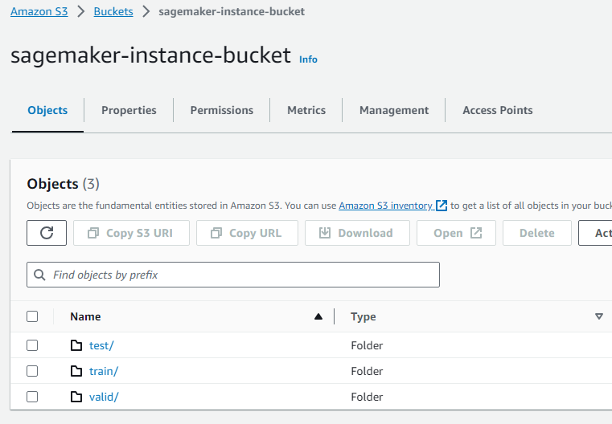

We selected a standard studio notebook instance ml.t3.xlarge 4vCPUs, 16 GiB RAM, costing $0.20/hr.

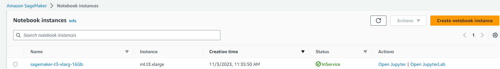

The reason for the decision was that we could not download and upload files from our initial ml.t3.medium due to 4Gb of data and other files there occuping space that are important and we must hold for some time.  

For our training stage we launched inside the notebook an accelerated computing instance of ml.g4dn.xlarge, 4vCPUs, 16 GiB RAM costing $0.736/hr. 

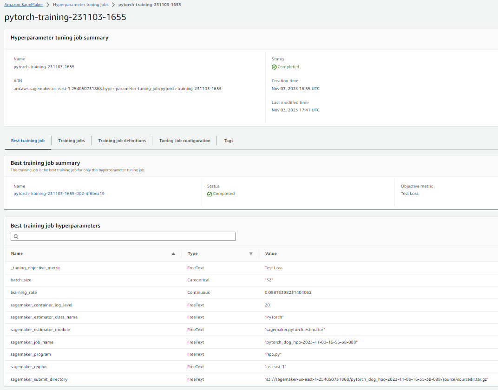

For the deployment part we selected to launch inside the notebook instance an ml.m5.xlarge because we do not need more computing power for the deploy.

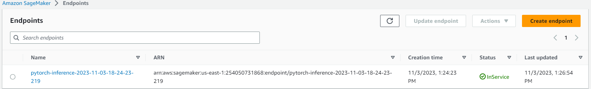

#### EC2 Training

We selected a g2.2xlarge EC2 Deep Learning Instance because is it has PyTorch installed and we need a GPU accelerated computing power to train faster.

For activatting Pytorch:
    source activate pytorch
Execute the script for start downloading files, create the folder and train the model on the EC2.
    ./script.sh

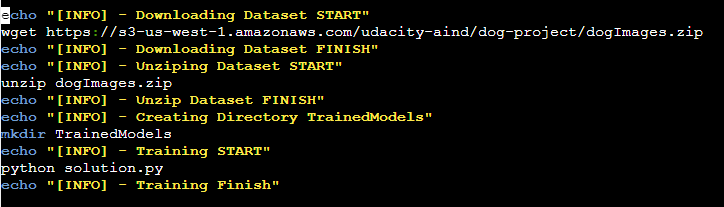

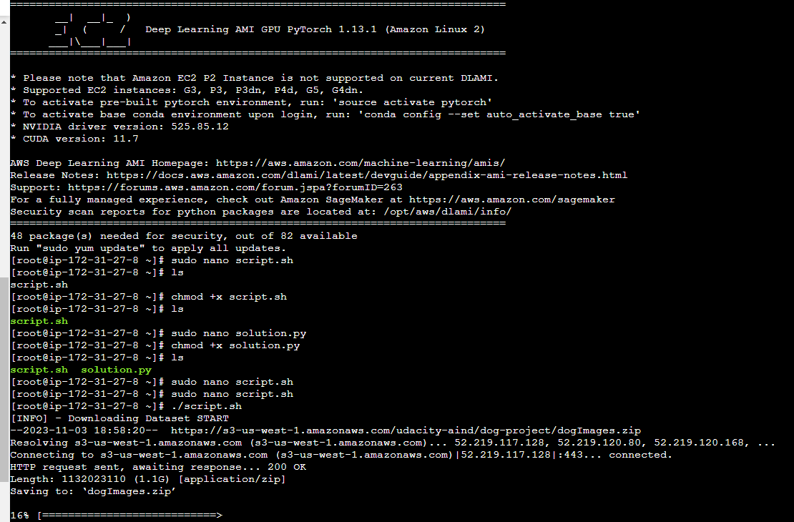

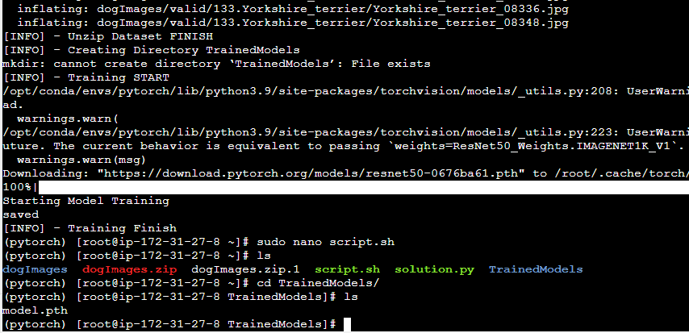

Main differences bewteen the file from the notebook and the file from the EC2 instance are:
 - On *hpo.py* we log the metrics, on the EC2 not.
 - On *hpo.py* we trained for 50 epochs and on the EC2 for 5.
 - On *hpo.py* we are training for the full dataset of train, on the EC2 we are just testing if it trains using the test dataset
 - Finally the main big difference is that we enter at a __main__ inside the *hpo.py* for and request for some parameters and hyperparameters and on the EC2 not, we just load directly without any configuration and a predefined batch size of 2.

#### Lambda function setup

We setup a lambda function to ensure correct response of the deployment.  

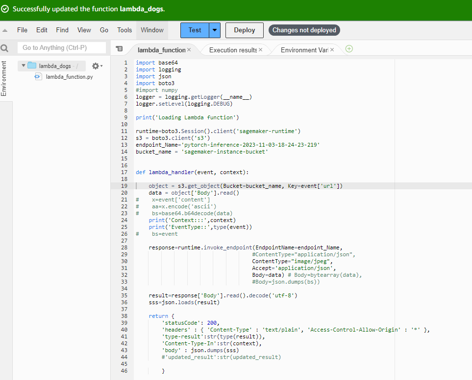

As shown above we ensured that we had all correct response type information as AWS suggests for lambdas. 

#### Security and Testing

The lambda function has an event based on one of our sagemaker buckets from oue S3.

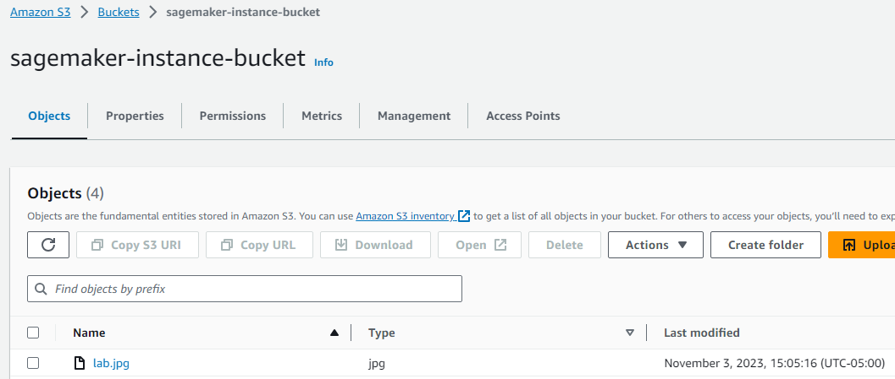

The lambda response is based on a probability of all the dog classes.

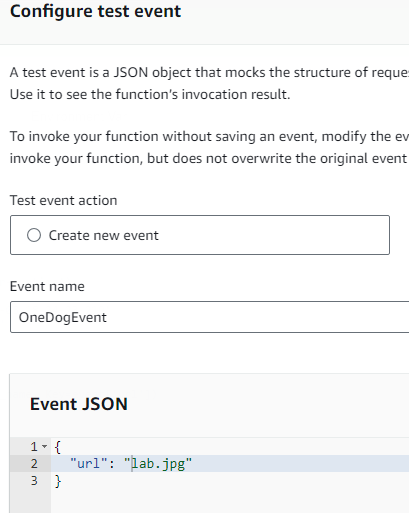

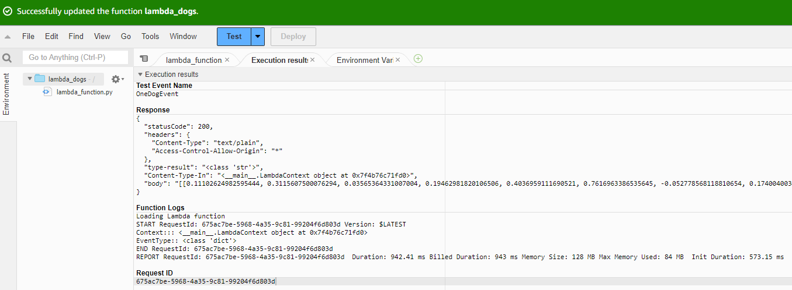

For the endpoint invocation to work, we had to enable the sagemaker role to enable calls for it.

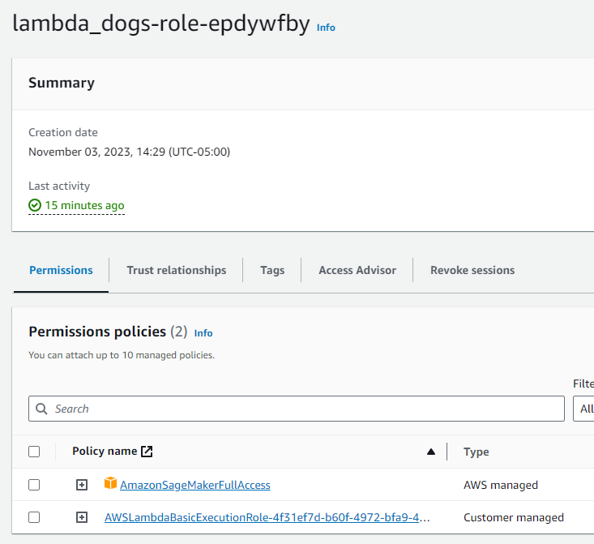

One of the potential vulnerabilities of the IAM setup is that we have full access to AWS Sagemaker and that role in particular can launch training jobs, deploy and delete models.

Another possible issue is that we have not successfully configured correctly the specific rules to use the VPC setup for our own uses.

#### Concurrency and auto-scaling

One way to improve response time with traffic is to use autoscaling and concurrency.  

*Autoscaling* allows deployed enpoints to respond to multiple request simultaneously. We can set the maximum instance count, scale-in cool down and scale-out cool down that are the times it delays to deploy or delete those deploys.

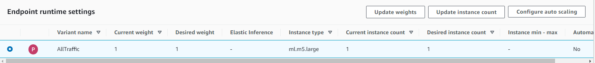

We can modify the instance count for autoscaling

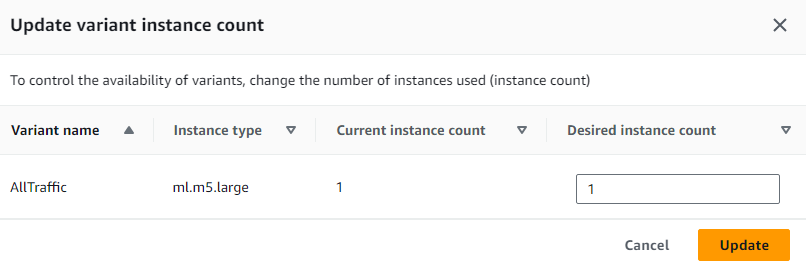

We could also ensure correct configuration of varying instance cound and the cool down in and out with the specified times.

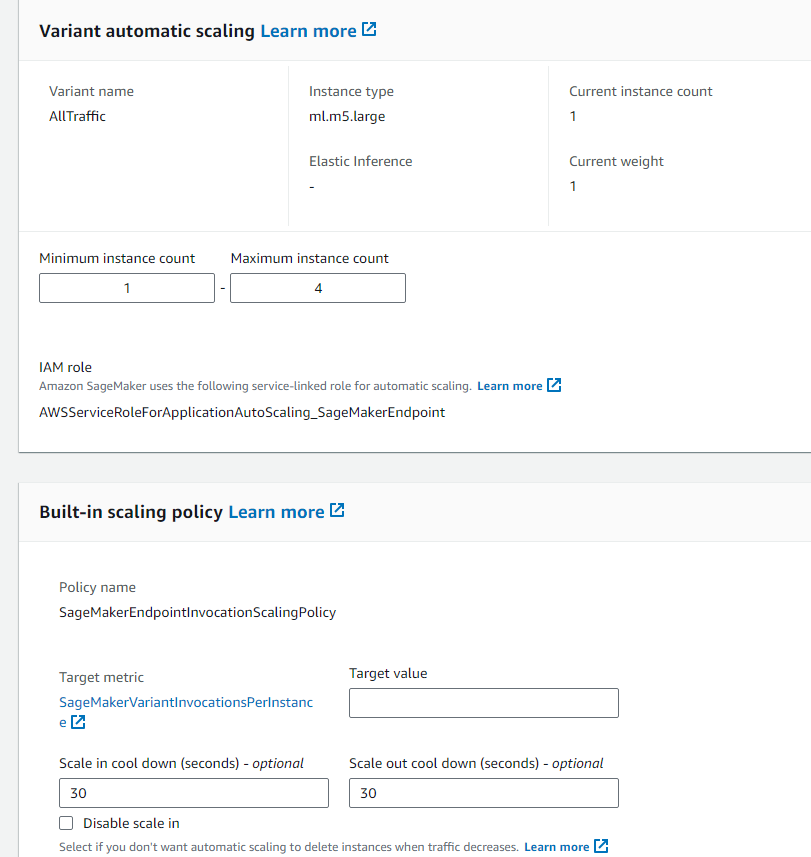

*Concurrency* are for lambda functions, because lambda functions process one (1) request at time, in high traffic data streams, the latency increases and we must implement this feature.  

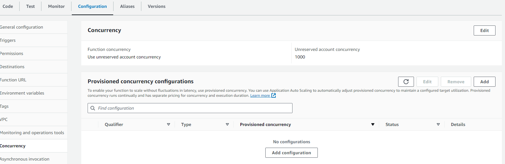

- If the traffic is low there is no need to concurrency.  
- If you implement concurrency you have to decide to implement of *reserved concurrency* 
  - Lower cost
  - Hard maximum (it can be divided the workload between deployed endpoints)
  - The disadvantage of this approach is that if the hard maximun is reached you will experienc latency.  
- The other type of concurrency is *provisioned concurrency*
  - This covers all the disadvantages of the *reserved concurrency* but
  - Has a higher cost at a flexible maximum.  
  - This can achieve very low traffic latency on any scenario.

For concurrency of our lambda function we could first make a version of the $LATEST lambda.

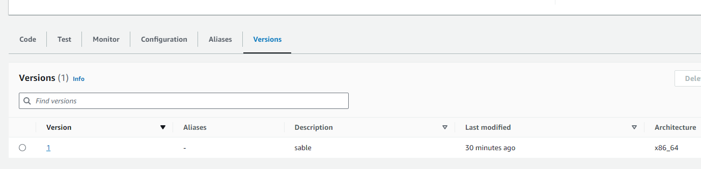

Depending of the demand we could set the:

Provisioned Concurrency
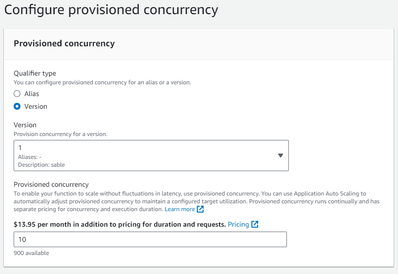

or

Reserved Concurrency
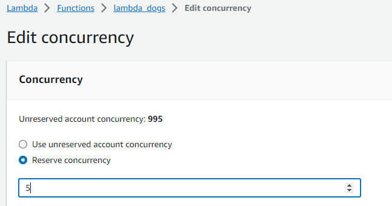

 <b>Video Explanation<b>

Machine Learning Operations on Sagemaker

 <b>Contributing<b>

Your contributions are always welcome! Please feel free to fork and modify the content but remember to finally do a pull request.

 :iphone: <b>Having Problems?<b>

 

 <b>License<b>

